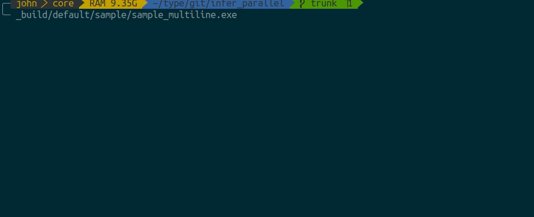
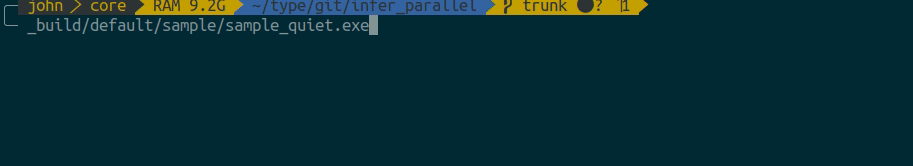

# Infer_parallel

 This library tries to contain the core parallel, message-passing, and
 task bar components used in
 [Infer](https://github.com/facebook/infer). It wraps them in a tidier
 interface, and builds with `dune`. It is a personal best effort and
 offered 'as-is': there is no guarantee for maintenance.

 This project was inspired by Rijnard van Tonder's
 [hack_parallel](https://github.com/rvantonder/hack_parallel).

## Samples
 You can find a sample code in [sample/](sample/).

### Multiline

### Multiline + Keep Going

### Multiline + Abort (NOT Keep Going)

### Quiet

